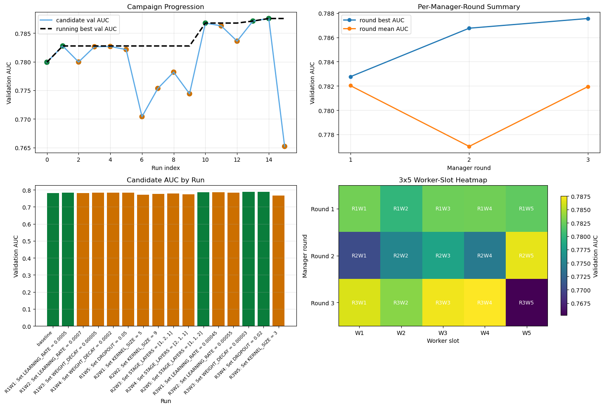

# Control-Plane Guided Autonomous Research System

**Stage 1 Prototype — Production-Minded Autoresearch Harness**
*April 2026 · Internal Technical Review*

---

## Executive Summary

This document presents the Stage 1 prototype of a **governed autonomous experimentation system** designed to automate iterative model-tuning workflows while maintaining full auditability, data privacy, and reproducibility. The system pairs a strong planning model with a bounded local execution agent, mediated by a lightweight control plane that enforces an explicit experiment lifecycle.

A full end-to-end campaign has been completed and verified. Running **3 manager rounds of 5 worker experiments each (15 total runs)** on a ResNet-based binary classifier for near-threshold signal detection, the system achieved a **validation AUC improvement from 0.7799 to 0.7876 (+0.77%)**, identifying the winning combination of a reduced learning rate, adjusted network depth configuration, and tighter regularization — all without any manual intervention after the initial setup.

The prototype demonstrates three core properties required for a production research system: **controllability** (bounded worker editing surface, no uncontrolled file modifications), **auditability** (append-only experiment memory, full decision rationale on every keep/discard), and **scalability by design** (the architecture supports multi-worker, multi-node, and parallel branch execution as direct extensions of the same control plane).

---

## Campaign Results

The primary demonstration is a 3 × 5 campaign on the ResNet_trigger node: three manager rounds, each directing five bounded worker experiments, for fifteen total governed runs. The manager received only a structured status and memory summary between rounds, with no access to model weights or raw data.

| Metric | Value | Notes |
|---|---|---|
| Baseline validation AUC | **0.7799** | Starting point before any manager iteration |
| Best validation AUC | **0.7876** | R3W4: LR=0.0005, weight decay=0.00003, dropout=0.02 |
| Improvement | **+0.0077 (+0.77%)** | Autonomous, no manual intervention |
| Total experiments run | 15 | 3 rounds × 5 worker slots |
| Experiments kept / discarded | 5 kept / 10 discarded | All decisions recorded with rationale |
| Execution environment | 100% local (CPU) | Ollama + Qwen 2.5 7B Coder, no external API |

The four plots below summarize the full campaign. The top-left panel shows candidate AUC per run alongside the running best, illustrating how the system progressively refined its strategy across rounds. The top-right panel confirms that round-best AUC improved monotonically across all three manager rounds. The bottom-left bar chart provides a per-run comparison, with green indicating kept experiments and orange indicating discards. The bottom-right heatmap reveals that Round 2 explored architectural changes that performed poorly overall, while Round 3 converged on fine-grained regularization tuning, which produced the best results.


*Figure 1. Campaign progression: candidate AUC per run (top-left), per-round best and mean AUC (top-right), per-run AUC bar chart with keep/discard coloring (bottom-left), and worker-slot heatmap (bottom-right).*

The progression is notably well-behaved. Round 1 identified that a modest learning rate reduction (1e-3 → 5e-4) improved performance. Round 2's exploration of architectural modifications (kernel size and stage layer configurations) was largely unsuccessful, with the exception of `STAGE_LAYERS=[1,1,2]` which provided a useful signal. Round 3 exploited this knowledge to combine **fine regularization tuning with the established learning rate and depth configuration**, converging on the best result. This pattern — explore in early rounds, exploit in later rounds — emerged autonomously from the manager's memory-guided reasoning, not from explicit rules.

---

## Problem and Motivation

Near-threshold binary classification on physics detector waveforms presents a practically difficult optimization problem. The signal-to-noise boundary is tight, training is sensitive to small hyperparameter changes, and the performance metric (validation AUC) fluctuates significantly across runs with different random seeds. In this regime, a human researcher conducting manual experiments must track changes, avoid repeating failed configurations, and correctly attribute performance differences to specific modifications — a slow and error-prone process.

Three additional constraints make naive automation inadequate. First, the underlying data is proprietary; any system that sends model inputs or outputs to an external service creates a data leakage risk. Second, there is a need for reproducibility: every experiment modification must be logged in a form that allows another engineer to reconstruct exactly what was changed and why. Third, agent-based systems that operate with unconstrained file access can inadvertently corrupt the code under study, making the experiment history unreliable.

This system was designed to address all three constraints simultaneously, rather than treating automation, privacy, and auditability as competing priorities.

---

## System Architecture

The system is structured as three cooperating layers separated by explicit interfaces. This separation is the central architectural decision, and it is what makes the system both safe and extensible.

### Control Plane

The control plane is the governance layer. It owns the experiment state machine, exposes a REST API (`/health`, `/status`, `/run`, `/keep`, `/discard`, `/memory`), and enforces the lifecycle contract. No experiment can begin without an explicit `/run` request, and no result is committed to memory without an explicit `/keep` or `/discard` decision with a rationale. The control plane also maintains an append-only JSONL memory store that accumulates the full experiment history across sessions.

The key enforcement mechanism is the **pending-run guard**: if a run is already in progress, the control plane rejects a new `/run` request rather than queuing or overwriting it. This ensures that the experiment ledger is always consistent and that no two experiments are entangled.

### Manager (Planning Layer)

The manager operates at the policy and reasoning level. Before each round it reads the current `/status` and `/memory-summary` endpoints, which provide the full history of what has been tried and the best current result. It then proposes a single bounded objective — a change to exactly one or two hyperparameters in `train.py` — and submits it via `/run`. After reviewing the returned metrics it issues a `/keep` or `/discard` with an explicit rationale.

During the Stage 1 campaign, the manager role was filled by an interactive Codex session operating in `manual_codex` mode. This was intentional: it allowed the manager reasoning to be inspected and verified at each step before the fully automated `/loop` path is used for longer campaigns.

### Worker (Execution Layer)

The worker is a bounded code-editing agent constrained to a single file (`train.py`). It receives the manager's objective, proposes a diff, applies it, runs the training loop, and returns structured metrics. A hard assertion verifies that only the allowed file was modified:

```python
assert changed_files == ["train.py"]
```

This constraint is what makes the experiment history trustworthy: every performance change can be unambiguously attributed to a specific code change, because no other file was touched.

---

## Key Design Properties

### Auditability

Every experiment produces four artifacts: the git commit hash of the modified code, the validation metric, the keep/discard decision, and the manager's rationale. These are written to an append-only memory file and a tab-separated results ledger. Any experiment in the campaign can be reproduced by checking out the corresponding commit and rerunning with the same seed.

### Data Privacy and Local Execution

The worker model (Qwen 2.5 7B Coder via Ollama) runs entirely on local hardware. No training data, model weights, or intermediate results leave the machine. This satisfies the IP and data governance requirements that preclude cloud-based code agents for proprietary research workloads.

### Memory-Guided Iteration

The manager's memory summary prevents redundant experimentation. Before each round, the manager reads a structured summary of what was tried and what failed. In the campaign, this led to the manager correctly avoiding learning rate values that had been screened in Round 1 when it returned to learning rate tuning in Round 3, instead exploring the unexplored neighborhood around the successful 5e-4 value.

### Measurable Decision-Making

All keep/discard decisions are based on a single explicit criterion: `delta = candidate_auc − current_best_auc > 0`. There are no heuristics, no subjective judgments, and no opaque model-internal reasoning that cannot be inspected. This is the property that distinguishes a governed research system from what is sometimes called "agent theater" — the appearance of autonomous research without accountable decision logic.

---

## Comparison to Traditional Workflow

| Dimension | Traditional Manual Workflow | This System |
|---|---|---|
| Experiment pace | 1–2 per day (manual setup, tracking) | 15 governed runs in one overnight session |
| Memory | Researcher's notes; easily lost or inconsistent | Append-only JSONL; persistent across sessions |
| Reproducibility | Code changes tracked ad-hoc if at all | Every change is a validated git diff with commit hash |
| Decision accountability | Implicit / tacit knowledge | Explicit rationale stored per experiment |
| Data governance | Risk of leakage via cloud tools | 100% local execution; no external API calls |
| Scalability | Limited by researcher bandwidth | Extends to multi-worker and parallel branches |

---

## Roadmap and Next Steps

Stage 1 proves the core loop on a single node with a single worker. The architecture is explicitly designed to scale, and the following extensions represent direct upgrades within the same framework rather than redesigns.

**Stage 2: Automated Manager Loop and Longer Campaigns.** The current `manual_codex` manager mode will be replaced by fully automated `/loop` execution, allowing campaigns of 50+ runs to proceed overnight without human intervention. The first target is a 5-round × 10-worker campaign on the ResNet_trigger node to verify stable multi-round strategy convergence.

**Stage 3: Multi-Node and Parallel Branches.** The control plane's API is node-agnostic. Directing a second worker node requires only pointing the `/run` endpoint at a different node root. A parallel branch manager can issue simultaneous experiments on different hypotheses, compare results, and select the best branch — a pattern that maps directly to the distributed experiment workflows used in production ML infrastructure.

**Stage 4: Domain Integration.** The target domain remains detector signal reconstruction. Immediate application opportunities include optimal filter tuning for near-threshold trigger logic, EMPCA basis optimization, and trigger threshold parameter sweeps. The `prepare.py`/`train.py` separation — where data pipeline code is fixed and only the modeling code is editable — provides a natural safety boundary for these applications.

**Optional: UI and Monitoring Layer.** A lightweight React dashboard for visualizing campaign progression, memory summaries, and live experiment status is designed and ready for implementation. This is not required for the research workflow but would support broader team adoption and director-level visibility into ongoing campaigns.

---

## Implementation Stack

The system is implemented in Python (control plane and worker orchestration) and Rust (the `claw` CLI runtime). The worker model is Qwen 2.5 7B Coder running via the Ollama local inference server, with an OpenAI-compatible API surface. The experiment node (ResNet_trigger) uses PyTorch with a custom 1D ResNet backbone. All components run on local hardware with no cloud dependency.

The repository is organized into three directories: `harness/claw-code` (the control plane and manager runtime), `nodes/ResNet_trigger` (the active experiment node), and `nodes/autoresearch-macos` (the reference node used during initial development). Notebooks in both locations provide interactive inspection, plotting, and verification of campaign results.

---

## Conclusion

The Stage 1 prototype demonstrates that a minimal but correctly architected autonomous research system can meaningfully improve on manual experimentation workflows — not only in speed, but in the properties that matter most for scientific rigor: reproducibility, auditability, and controlled decision-making.

The 3 × 5 campaign showed a **+0.77% improvement in validation AUC** from baseline, achieved autonomously, with a complete and inspectable record of every decision. More importantly, the campaign demonstrated **emergent explore-then-exploit behavior** without explicit programming of that strategy: the manager's memory-guided reasoning naturally produced Round 1 breadth search, Round 2 architectural exploration, and Round 3 fine-grained exploitation of the best-performing configuration class.

This is the foundation of a research operating system. The next phase extends the same architecture to longer campaigns, multiple nodes, and the target detector physics domain.
